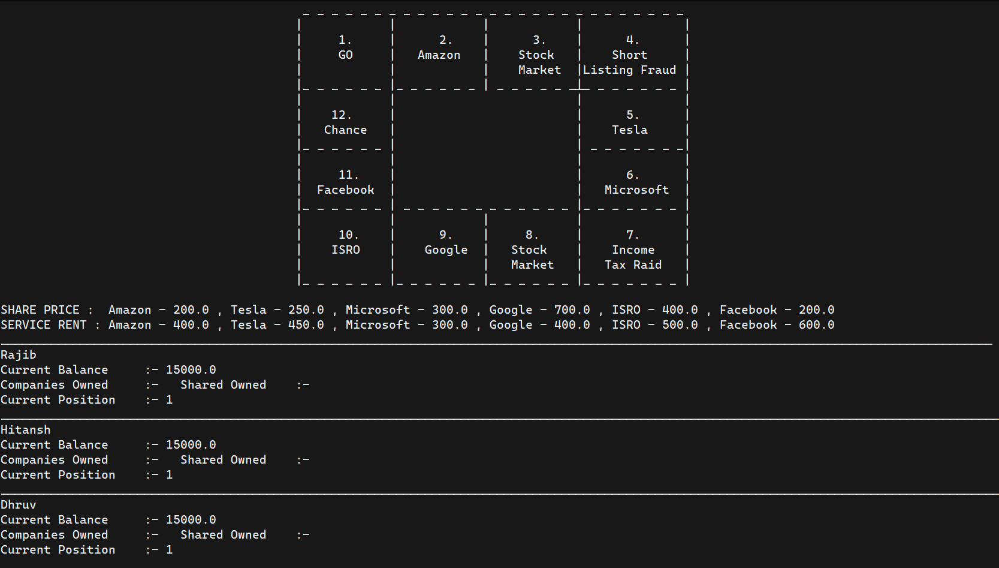

# Monopoly Stock Exchange  
  
## About the GAME  
This is a basic java implementation program that mainly deals with oops concepts. Only 2 or 3 players can play the game at once for now. If you're familiar with Monopoly, this game is fairly similar. Instead of displaying countries or cities, it deals with real-life companies. In the game, players can buy companies and shares. Just like real shares, the value of shares will increase or decrease which will result in profit or loss for the players. The first player to cross $15k wins the game or gets bankrupted if his current balance is 0. We hope you have fun while playing the game. Please report any issues you find.

## Tech Skills Implemented  
**JAVA**, Object Oriented Programming, Modular Programming

## Instructions For Playing The Game  
1. This is a multiplayer player  modern stock trading game.
2. Player who reaches $ 20k wins the game and player with $ 0 balance loses the game.
3. Players will have an option to move maximum of 3 blocks at a time.
4. Once you land on a company you will get the chance to buy that company and you will own company shares.
5. If another player lands on your company, he/she will have to pay service rent and your share price will also increase by 10 % .
6. Blocks numbered 3,8 are the |Trading blocks|. Here players can buy other company's shares.
7. The players will have an option to sell their share anytime during the course of the game.
8. 4th and 12th are the | Chance | block, there are 7 chances which will be chosen randomly by computer.  

## Installing and Running the game 
1. Download the Java Development Kit (JDK) from [here](https://www.oracle.com/in/java/technologies/javase-downloads.html).
2. Install [Git](https://git-scm.com/downloads).
3. Fork this repository on your own github profile.
4. Clone this repository on your local machine.
5. Open the terminal with project opened on your local machine and execute the following code.  
   `cd src`  
   `javac App.java` (To compile the game)  
   `java App` (To run the game)  
6. Now you can play the Monopoly Stock Exchange Game.

## Contributors  
[Rajib Mondal](https://github.com/mondalraj)            
[Hitansh Gupta](https://github.com/Hitansh1G)            
[Dhruv Trehan](https://github.com/DhruvTrehan29)

